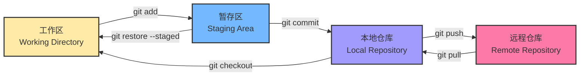

# Git 和 GitHub 的

## 为啥一定要学 Git？

**用 Git 以前**：
```
我的项目/
├── 代码v1.cpp
├── 代码v2.cpp
├── 代码v2_最终版.cpp
├── 代码v2_真的最终版.cpp
├── 代码v2_这次真的是最终版.cpp
└── 代码v2_修复bug后的最终版.cpp
```

**用了 Git 之后**：
<div class="tip-box success">

- ✅ 所有历史版本都能看到，想回退就回退
- ✅ 和同学一起写代码不怕冲突了
- ✅ 代码自动备份到 GitHub，电脑坏了也不慌

</div>

### 什么时候用得上？

1. **写作业**：每次写完一个功能就提交一次，改坏了能马上退回去
2. **课程设计**：3个人一起写代码，不用U盘传来传去了
3. **准备面试**：把作业项目整理好放 GitHub 上，简历直接附上链接
4. **自学项目**：跟着教程敲代码，每节课的代码都能保存
5. **看开源代码**：想看大佬的代码怎么写的，直接 clone 下来

---

## Git 的使用流程

### 工作流程图
> 简单来说就是：本地改代码 → 暂存 → 提交 → 上传

<div data-aos="fade-up">



</div>

### 一些术语的白话翻译

| 专业术语              | 我的理解                 | 打个比方       |
| --------------------- | ------------------------ | -------------- |
| **仓库 (Repository)** | 就是你的项目文件夹       | 一个项目文件夹 |
| **提交 (Commit)**     | 更新代码                 | 游戏存档点     |
| **分支 (Branch)**     | 另开一条开发路线         | 平行宇宙       |
| **克隆 (Clone)**      | 把别人的项目复制下来     | 下载项目       |
| **推送 (Push)**       | 把你的代码传到 GitHub    | 上传文件       |
| **拉取 (Pull)**       | 从 GitHub 更新最新的代码 | 同步文件       |

---

## 安装 Git

### Windows 系统安装步骤

1. 去 [Git 官网](https://git-scm.com/download/win) 下载
2. 下载 64-bit 版本（现在的电脑基本都是64位）
3. 安装的时候注意这几个地方：
   - ✅ **一定要勾** "Git Bash Here"（这样能在任意文件夹右键打开Git）
   - ✅ 如果你装了 VSCode，选择 "Use Visual Studio Code as Git's default editor"
   - ✅ 其他的直接默认，一路 Next 就行

4. 装好后测试一下：
   ```bash
   git --version
   # 看到 git version 2.xx.xx 就说明装好了
   ```

### 装完必做的配置

```bash
# 设置你的名字（用啥都行，中文英文都可以）
git config --global user.name "你的名字"

# 设置邮箱（建议用常用的，后面注册 GitHub 也要用）
git config --global user.email "你的邮箱@email.com"
```

---

## GitHub 的使用

### 第一步：注册 GitHub

1. 去 [GitHub 官网](https://github.com)
2. 点 "Sign up" 注册
3. <div class="tip-box tip">

**💡 我的建议**：
   - **用户名**：取个正常点的，别太中二，以后找工作简历上要写的
   - **邮箱**：随意，用学校邮箱更好
   - **头像**：随意，不过专业一点的头像看着更靠谱

</div>

4. <div class="tip-box success">

**🎁 白嫖学生福利包**：
   - 去 [GitHub Education](https://education.github.com/pack) 申请
   - 能免费拿到：GitHub Pro、免费域名、云服务器、还有一堆开发工具

</div>

### 第二步：创建远程仓库

#### 方法一：在 GitHub 创建新仓库

1. 登录 GitHub，点击右上角 "+" → "New repository"
2. 填写信息：
   - **Repository name**：my-first-repo
   - **Description**：我的第一个项目
   - **Public/Private**：选择公开或私有
   - ✅ 勾选 "Add a README file"（可选）
   - 选择 License：MIT License（推荐）

3. 点击 "Create repository"

### 第三步：克隆远程仓库

```bash
# 使用 HTTPS
git clone https://github.com/username/repo-name.git

# 克隆到指定目录
git clone git@github.com:username/repo-name.git my-folder
```

### 第四步：同步远程更改

```bash
# 拉取远程更新（fetch + merge）
git pull

# 等价于
git fetch origin
git merge origin/main

# 推送本地更新
git push
```

---

## 一些资源

### 推荐的教程（按学习顺序）

**1. 先看视频快速入门**：
- **尚硅谷的Git教程**（B站）：https://www.bilibili.com/video/BV1vy4y1s7k6
  - 看前面1-2小时的基础部分就够用了
  - 讲得很清楚，适合新手

**2. 边玩边学**：
- [Learn Git Branching](https://learngitbranching.js.org/?locale=zh_CN)
  - 超好玩的交互式教程，像打游戏一样学Git

**3. 遇到问题再查文档**：
- [Pro Git 中文版](https://git-scm.com/book/zh/v2)（免费电子书）
  - 别一上来就看这个，会劝退的
  - 遇到具体问题了再来翻对应章节

### 懒得用命令行的话...

**图形化工具**：
- [GitHub Desktop](https://desktop.github.com/)：GitHub 官方的，简单好用
- [GitKraken](https://www.gitkraken.com/)：界面很炫酷，功能强大
- [Sourcetree](https://www.sourcetreeapp.com/)：免费的，功能够用

---

## 写在最后

**Git 真的很重要**，这是我学了之后最大的感受：

- 💾 **不怕改坏代码了**：随时可以回退，大胆尝试
- 👥 **团队合作方便了**：不用U盘传来传去，也不怕覆盖别人的代码
- 🌐 **代码备份到云端**：电脑坏了也不慌，GitHub上都有

<div class="tip-box success">

**🎯 学习经验**：

- 📝 **别光看教程**，跟着敲一遍，自己建个仓库练练手
- 🔄 **从最常用的开始学**，add、commit、push 这几个用熟了再说
- 👥 **找同学一起练**，组个小队做个项目，能学到很多
- 🌟 **试着给开源项目提PR**，哪怕只是改个错别字也是贡献
- 📚 **遇到问题多查多问**，百度、Google、DeepSeek 都是你的老师

</div>

**特别说明**：
- 🌐 这些内容大多来自网络资料（B站教程、GitHub Docs、Stack Overflow等）
- ⚠️ 可能有不准确的地方，欢迎指正和补充

---

<p align="center">
  <sub>📝 最后更新：2025-10-21 | 持续完善中，有问题欢迎提 Issue</sub>
</p>
